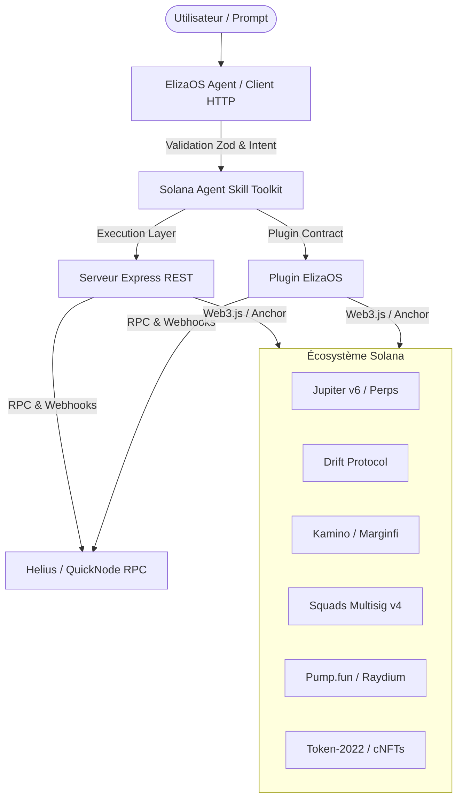

# Solana Agent Skill Toolkit

Toolkit Node.js / TypeScript (Node 22) open-source d'actions et d'outils Solana prêt pour **ElizaOS** et serveurs **Express REST API**. 

Il fournit une couche d'abstraction standardisée permettant à un agent autonome de déclencher des opérations Solana complexes de manière programmable et sécurisée.

## 🏗️ Architecture System



## 🛡️ Modèle de Sécurité & Validation (Safety First)

Pour prévenir tout comportement erratique d'un agent autonome sur le Mainnet :
- **Strict Schema Validation (Zod)** : Chaque paramètre injecté par un LLM est validé par un schéma strict avant la construction de la transaction.
- **Bornage du Slippage & Montants** : Protections contre les valeurs négatives ou aberrantes.
- **Gestion Robuste des Clés** : Séparation stricte des clés privées via variables d'environnement, aucune clé stockée en dur.
- **Fallback & Error Catching** : Interception globale des erreurs RPC et retour de messages d'erreur explicites à l'agent sans crash du processus.

## 🧪 Matrice des Modules & Couverture des Tests

La suite de tests (`npm test`) valide **13 scénarios critiques** répartis en 5 catégories :

| Module / Catégorie | Type de Test | Portée du Test | Statut |
| :--- | :--- | :--- | :---: |
| **Core & Function Calling** | Unitaire / Schema | Validation stricte des spécifications Zod/AI | Validé |
| **ElizaOS Plugin** | Contrat | Enregistrement des actions et handlers ElizaOS | Validé |
| **v1.1 Base & Staking** | Intégration Live | Jupiter Price v2 API, Portfolio & Liquid Staking Jito | Validé |
| **API REST Microservice** | E2E HTTP | Serveur HTTP réel, endpoints Express & Payloads | Validé |
| **M1 : Launchpad & DEX** | API Integration | Pump.fun token info & Raydium AMM | Validé |
| **M2 : Money Markets** | Simulation / API | Taux Kamino/Marginfi & simulation d'emprunt | Validé |
| **M3 : Perps & Levier** | Unit / Contract | Drift / Jupiter Perps market info & position leverage | Validé |
| **M4 : Multisig & Blinks** | Unit / Contract | Squads v4 multisig creation & Dialect Blink URLs | Validé |
| **M5 : Signals & Webhooks**| Integration | Traitement des webhooks transactionnels Helius/QuickNode | Validé |
| **M6 : Advanced Assets** | Unit / Contract | Token-2022 extensions (Transfer Tax) & cNFTs | Validé |

## 🌐 Endpoints REST API — Preuves d'Exécution par Module

Démarrage du serveur REST :
```bash
npm start
```

### Module 1 : Launchpad & DEX (Pump.fun / Raydium)
```bash
curl -X POST http://localhost:3000/api/solana/pumpfun/buy \
  -H "Content-Type: application/json" \
  -d '{"mint": "2zMMhcB612z73mB52v6dGdb655752t22", "amountSol": 0.05, "slippage": 1}'
```

### Module 2 : Money Markets (Kamino / Marginfi)
```bash
curl -X POST http://localhost:3000/api/solana/lending/deposit \
  -H "Content-Type: application/json" \
  -d '{"protocol": "kamino", "asset": "USDC", "amount": 50}'
```

### Module 3 : Perps & Levier (Drift / Jupiter Perps)
```bash
curl -X POST http://localhost:3000/api/solana/perps/open \
  -H "Content-Type: application/json" \
  -d '{"market": "SOL-PERP", "side": "long", "amount": 1, "leverage": 2}'
```

### Module 4 : Multisig Squads v4 & Blinks
```bash
curl -X POST http://localhost:3000/api/solana/squads/create \
  -H "Content-Type: application/json" \
  -d '{"threshold": 2, "members": ["83bd3y4...", "5Q544f..."]}'
```

### Module 5 : Signals & Webhooks (Helius)
```bash
curl -X POST http://localhost:3000/api/solana/webhook/helius \
  -H "Content-Type: application/json" \
  -d '{"type": "TRANSFER", "signature": "5Kn...", "accountData": []}'
```

### Module 6 : Token-2022 Extensions
```bash
curl -X POST http://localhost:3000/api/solana/token2022/transfer \
  -H "Content-Type: application/json" \
  -d '{"mint": "4k3Dyj...", "destination": "83bd3y4...", "amount": 100, "fee": 1}'
```

## 🤖 Exemple de Trace d'Exécution Agent (ElizaOS)

```
User Prompt: "Achète pour 0.1 SOL du token Pump.fun 2zMMhcB..."
├── 1. Agent Intent Detection -> Matching Action: "PUMPFUN_BUY"
├── 2. Validation Zod Schema -> Params: { mint: "2zMMhcB...", amountSol: 0.1 }
├── 3. Tool Execution -> Construction de la transaction Solana Web3.js
├── 4. Simulation & Sign -> Transaction signée via Keypair
└── 5. Result -> Output: { success: true, txHash: "4vN8sX..." }
```

## 🧪 Lancer la Batterie de Tests

```bash
npm test
```
