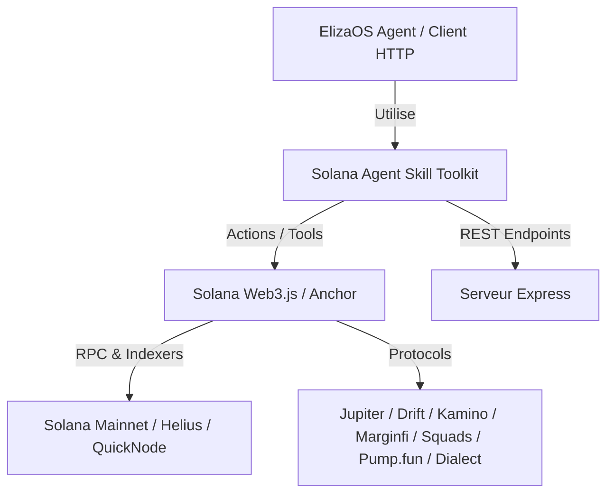

# Solana Agent Skill Toolkit

Toolkit Node.js / TypeScript open-source d'actions et d'outils Solana prêt pour **ElizaOS** et serveurs **Express REST API**. Conçu pour alimenter des agents autonomes avec la gestion du DeFi, des tokens v2, cNFTs, Perps, Blinks, Webhooks, et Multisig.

## 🏗️ Architecture



## 🚀 Fonctionnalités & Matrice des Modules

| Module | Intégrations / Protocoles | Actions / Capacités |
| :--- | :--- | :--- |
| **v1.1 Base** | Web3.js, Jupiter, Jito | Transfert SOL/SPL, Jupiter Swap, Staking Jito, Portefeuille |
| **M1 : Launchpad & DEX** | Pump.fun, Raydium | Minting/Trading Pump.fun, AMM Raydium |
| **M2 : Money Markets** | Kamino, Marginfi | Dépôt/Emprunt Lending / Borrowing, Liquidation risk check |
| **M3 : Perps & Levier** | Drift, Jupiter Perps | Positions Long/Short à levier, gestion du PnL / Collateral |
| **M4 : Multisig & Blinks** | Squads v4, Dialect | Création/Validation de propositions Squads, Solana Blinks |
| **M5 : Signals & Webhooks**| Helius, QuickNode | Traitement d'événements On-chain, Webhooks transactionnels |
| **M6 : Advanced Assets** | Token-2022, Metaplex | Extensions Token-2022 (Transfer Tax, Transfer Hook), cNFTs |

## 🛠️ Installation & Configuration

### 1. Prérequis
- Node.js 22+
- Clé privée Solana (format Base58)

### 2. Installation
```bash
npm install
npm run build
```

### 3. Variables d'environnement
Copier `.env.example` en `.env` et ajuster vos clés :
```bash
cp .env.example .env
```

## 🌐 Serveur REST API (Express)

Démarrage du serveur REST :
```bash
npm start
```

### Exemples d'appels cURL

#### 1. Transfert SOL
```bash
curl -X POST http://localhost:3000/api/solana/transfer \
  -H "Content-Type: application/json" \
  -d '{"to": "83bd3y4...", "amount": 0.1}'
```

#### 2. Jupiter Swap
```bash
curl -X POST http://localhost:3000/api/solana/swap \
  -H "Content-Type: application/json" \
  -d '{"inputMint": "So11111111111111111111111111111111111111112", "outputMint": "EPjFWdd5AufqSSqeM2qN1xzybapC8G4wEGGkZwyTDt1v", "amount": 100000000}'
```

#### 3. Drift Perps Long Position
```bash
curl -X POST http://localhost:3000/api/solana/perps/open \
  -H "Content-Type: application/json" \
  -d '{"market": "SOL-PERP", "side": "long", "amount": 1, "leverage": 2}'
```

## 🤖 Intégration ElizaOS

Importer le plugin directement dans l'initialisation de votre agent ElizaOS :

```typescript
import { solanaAgentPlugin } from "solana-agent-skill";
import { AgentRuntime } from "@elizaos/core";

const runtime = new AgentRuntime({
  plugins: [solanaAgentPlugin],
});
```

## 🧪 Exécution des Tests

Lancement de la suite de tests unitaires et d'intégration :
```bash
npm test
```
