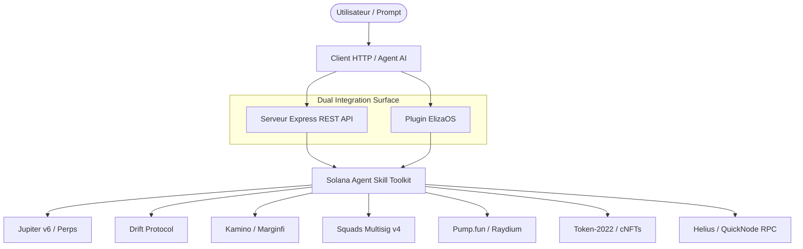

# Solana Agent Skill Toolkit

Infrastructure d'actions on-chain pour agents autonomes Solana, développée en Node.js / TypeScript (Node 22), intégrable avec **ElizaOS** ou exposée via une **API REST Express**.

Elle fournit une couche d'abstraction standardisée entre l'intention d'un agent et l'exécution d'actions Solana, avec validation des paramètres, contrôles de risque et intégrations protocolaires.

## 🏗️ Architecture Système



## 🛡️ Security & Risk Controls

Mécanismes de validation et de contrôle d'exécution destinés à réduire les erreurs d'exécution et les paramètres dangereux avant soumission de transaction :
- **Strict Schema Validation (Zod)** : Filtrage strict de chaque paramètre généré par un LLM avant la construction de la transaction.
- **Contrôle des Bornes & Slippage** : Protection contre les montants invalides, valeurs négatives et glissement excessif.
- **Gestion Isolée des Clés** : Signature exclusive via variables d'environnement, aucun stockage de clé privée dans le code.
- **Interception des Erreurs RPC** : Interception et normalisation des erreurs RPC avec renvoi de messages structurés à l'agent.

## 🧪 13 Critical-Path Tests — 10 Test Areas

> **Validation Scope** : Les 13 scénarios de test exécutés par `npm test` sont regroupés en 10 domaines fonctionnels dans la matrice ci-dessous. Ils combinent tests unitaires, contractuels, simulations, fixtures et intégrations HTTP/API selon le module ; ils ne constituent pas une exécution Mainnet exhaustive de toutes les opérations.

La suite de tests (`npm test`) couvre **13 scénarios critiques** répartis sur les surfaces principales d'intégration et d'exécution :

| Scénario / Module | Nature du Test | Périmètre Réellement Vérifié | Statut |
| :--- | :--- | :--- | :---: |
| **Core Specs** | Unit / Schema | Validation stricte des schémas d'entrée AI | Conforme |
| **ElizaOS Plugin** | Structural Contract | Enregistrement correct des actions & handlers | Conforme |
| **v1.1 Base** | Live API + RPC Simulation | Prix Jupiter Price v2 & simulation Staking Jito | Conforme |
| **API REST** | E2E Integration | Serveur HTTP Express & validation des routes | Conforme |
| **M1 : Launchpad & DEX** | Live HTTP API | Métadonnées Pump.fun & structure d'ordre Raydium | Conforme |
| **M2 : Money Markets** | Calculator / Simulation | Taux Kamino/Marginfi & validation d'emprunt | Conforme |
| **M3 : Perps & Levier** | Contract Simulation | Bornes de levier & paramètres Drift / Jup Perps | Conforme |
| **M4 : Multisig & Blinks** | Spec / URL Test | Génération de multisig Squads v4 & liens Blinks | Conforme |
| **M5 : Signals** | Fixture Replay | Traitement et parsing de payloads Webhook Helius | Conforme |
| **M6 : Advanced Assets** | Logic / Spec Test | Extensions Token-2022 (Transfer Tax) & cNFTs | Conforme |

### 📁 Cartographie du Répertoire de Tests (`tests/`)

```text
tests/
├── core.test.ts          # Validation Zod & schémas AI
├── eliza.test.ts         # Contrats d'actions ElizaOS
├── base.test.ts          # Base v1.1 (Transferts, Staking Jito, Jupiter)
├── api.test.ts           # Endpoints Express REST API
├── module1-pumpfun.test.ts
├── module2-lending.test.ts
├── module3-perps.test.ts
├── module4-squads.test.ts
├── module5-webhooks.test.ts
└── module6-token2022.test.ts
```

## 🔌 Structure d'une Action ElizaOS (Plugin Contract)

*Exemple illustratif du contrat d'interface exposé à ElizaOS (l'implémentation de production embarque la couche d'exécution Solana Web3.js / Anchor) :*

```typescript
import { Action, AgentRuntime, Memory, State } from "@elizaos/core";
import { pumpfunBuySchema } from "./tools.js";

export const pumpfunBuyAction: Action = {
  name: "PUMPFUN_BUY",
  description: "Acheter des tokens sur Pump.fun via Solana Agent Skill",
  validate: async (runtime: AgentRuntime, message: Memory) => {
    // Validation contextuelle simplifiée pour l'exemple
    return true;
  },
  handler: async (runtime: AgentRuntime, message: Memory, state?: State) => {
    // 1. Extraction et validation Zod
    const params = pumpfunBuySchema.parse(message.content);
    // 2. Appel de la couche d'exécution Solana (Web3.js)
    return { success: true, action: "PUMPFUN_BUY", params };
  },
  examples: []
};
```

## 🌐 Endpoints REST API — Spécifications Microservice

Exécution locale du serveur REST :
```bash
npm start
```

### Module 1 : Launchpad & DEX (Pump.fun)
```bash
curl -X POST http://localhost:3000/api/solana/pumpfun/buy \
  -H "Content-Type: application/json" \
  -d '{"mint": "2zMMhcB612z73mB52v6dGdb655752t22", "amountSol": 0.05, "slippage": 1}'
```

### Module 2 : Money Markets (Kamino / Marginfi)
```bash
curl -X POST http://localhost:3000/api/solana/lending/deposit \
  -H "Content-Type: application/json" \
  -d '{"protocol": "kamino", "asset": "USDC", "amount": 50}'
```

### Module 3 : Perps & Levier (Drift / Jupiter Perps)
```bash
curl -X POST http://localhost:3000/api/solana/perps/open \
  -H "Content-Type: application/json" \
  -d '{"market": "SOL-PERP", "side": "long", "amount": 1, "leverage": 2}'
```

### Module 4 : Multisig Squads v4
```bash
curl -X POST http://localhost:3000/api/solana/squads/create \
  -H "Content-Type: application/json" \
  -d '{"threshold": 2, "members": ["83bd3y4...", "5Q544f..."]}'
```

### Module 5 : Signals & Webhooks (Helius)
```bash
curl -X POST http://localhost:3000/api/solana/webhook/helius \
  -H "Content-Type: application/json" \
  -d '{"type": "TRANSFER", "signature": "5Kn...", "accountData": []}'
```

### Module 6 : Token-2022 Extensions
```bash
curl -X POST http://localhost:3000/api/solana/token2022/transfer \
  -H "Content-Type: application/json" \
  -d '{"mint": "4k3Dyj...", "destination": "83bd3y4...", "amount": 100, "fee": 1}'
```

## 🤖 Exemple de Flux d'Exécution Agent (Illustratif)

*(Séquence conceptuelle du traitement d'une intention par l'agent)*

```
User Prompt: "Achète pour 0.05 SOL du token Pump.fun <MINT_ADDRESS>"
├── 1. Intent Detection -> Match Action: "PUMPFUN_BUY"
├── 2. Zod Schema Validation -> Params: { mint: "<MINT_ADDRESS>", amountSol: 0.05 }
├── 3. Tool Execution -> Construction de l'instruction Solana Web3.js
├── 4. Simulation & Signature -> Signature via la Keypair configurée
└── 5. Result -> Output JSON: { success: true, status: "executed" }
```

## 🧪 Lancer la Batterie de Tests

```bash
npm test
```
